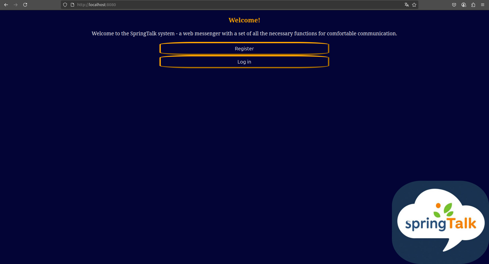
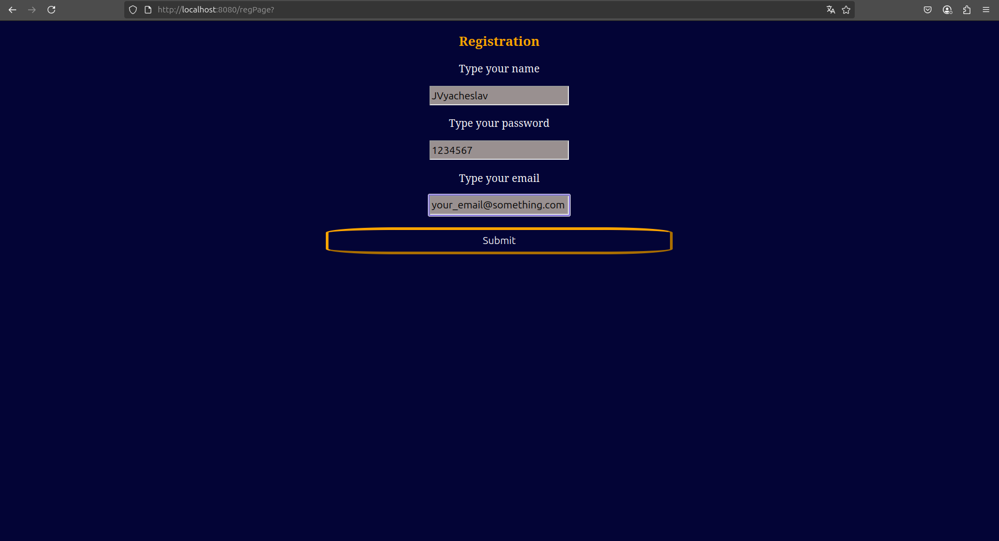
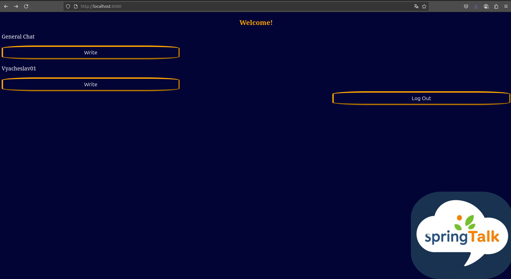
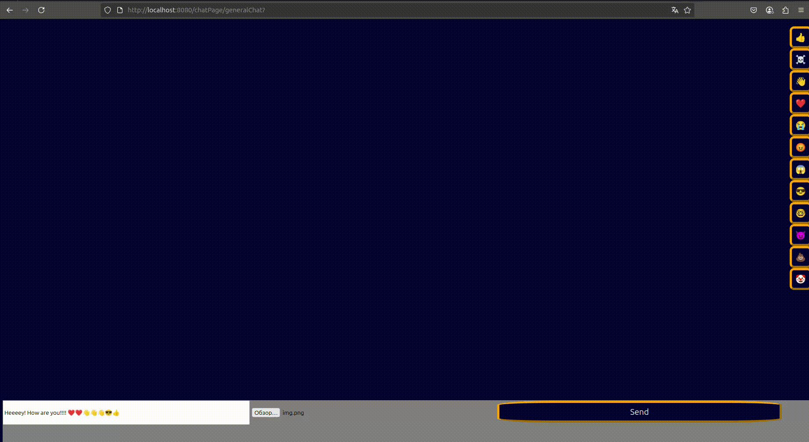

# SpringTalk web-application

##  PREFACE
#### This project is made specifically for participation in **java spring jam**.


### Tasks of this jam

- [X] The project must be written in **java**

- [X] The project should **allow messaging** between users

- [X] The project code is entirely **the author's creation**

<br>

# DESCRIPTION
<br>

### This is my first time doing projects for such competitions. I hope for your feedback.

## The project is a web service with: 
### 1. registration (two-factor)
### 2. authentication (Two ways)
### 3. personal ***text and graphic messages***
### 4. general chat

## Usage
### When you go to the main page after launch, you can see the following page: (if everything is ok)


### You can choose to register:

#### When registering, the user specifies an email address, where a code is sent confirming registration from the email address you specified in point 2.

### Or log in to an existing account in two ways.
<br>

### Once you have logged into your account, you can choose who you want to chat with (the system displays a list of all registered participants) or enter the general chat:


### Then you can calmly communicate with the interlocutor, you can use emoji, text or your .png files. You can even delete the message if you made a mistake with the addressee or wrote something wrong. The chat history is saved (however, deleted messages are deleted forever), so you can not worry about losing information in the chat.

P.s. Sorry for the quality of the gif, the file was slightly damaged during conversion.

### Finally, if you want, you can log out of your account by clicking the appropriate button on the main page.
<br>

# Setup and launch


## 1. To download a project to your local computer, you need to enter the next command:
```bash
git clone https://github.com/JVyacheslav/SpringTalk
```

## 2. For further work you will have to configure SpringTalk. 
### Since the project uses java mail api (for two-factor authentication) - you need to specify any **email** that you don't mind, and the **password** from it in the following fields in ***application.properties*** as follows:
```
email: your_email@gmail.com
pass: your_email_password

```
### Addition: For a quick start I ***recommend using gmail***. However, you can use another similar service, for this you need to configure mail.smtp.host in the EmailSettings class

___
### Clue: To authenticate your email, you ***may need an app password*** instead of a regular password. Information on creating one can be found on the email website.
___

### WARNING: Your email ***will not be used*** for any purpose other than to implement the distribution of two-factor authentication confirmation codes in the application. You ***have the right*** to refuse testing this application or you can study the code if you do not trust the author, but ***for testing 2FA you must use email in the configuration***. 

## If you do not want to add your email and password to the configuration, you can test the basic functionality of the application (without 2FA) by logging in under pre-created accounts in the database.
Data of prepared accounts:
1. Username: user1
password: 1234567
2. Username: user2
password: 12345678

## After turning on the application, just go to http://localhost:8080/
___
## 3. Finally, you can run the application in your IDE or use the following commands in the terminal:
```bash
sudo apt install maven

sudo apt install docker

mvn package

docker-compose up --build
```


### P.s. If you have any problems with launching, you can ask me for help, just ping me in Discord. 